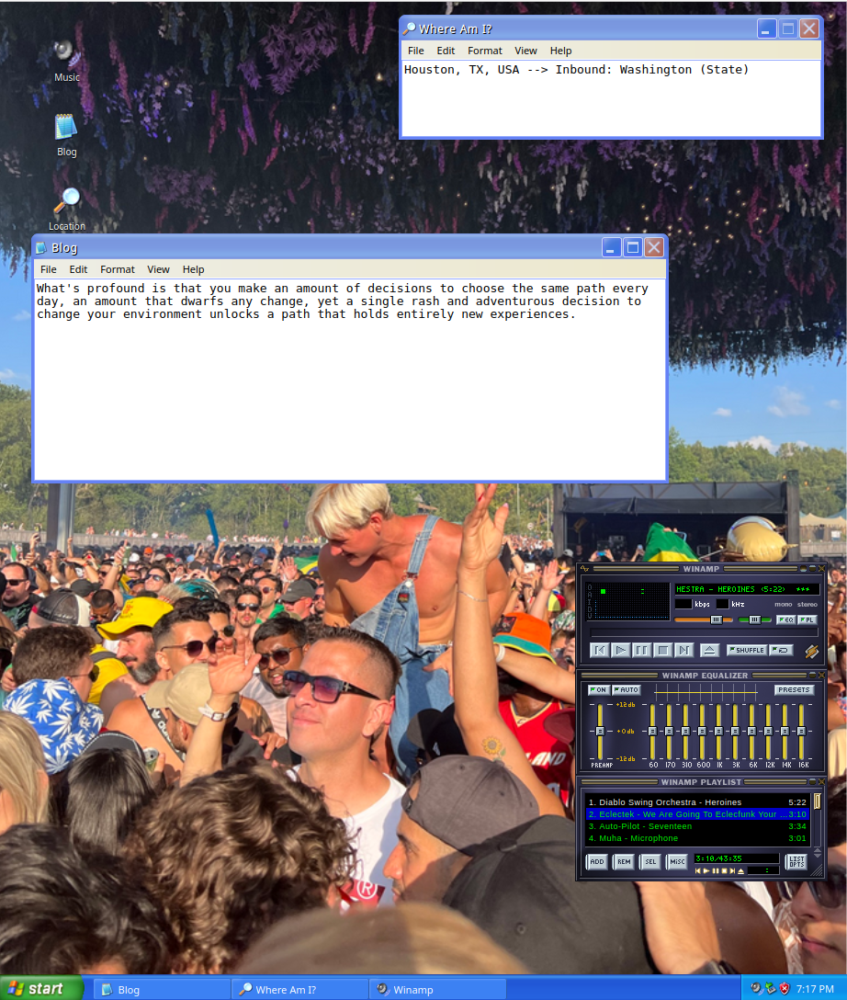

# gunnar.ai - a React.js personal website

'retro' is a node.js website designed for gunnar.ai. it is a dynamic and responsive web application that provides a platform for users to interact with the gunnar.ai domain. the website is built using modern web technologies and offers a range of features to enhance user experience.

## table of contents

- [installation](#installation)
- [usage](#usage)
- [features](#features)
- [contributing](#contributing)
- [license](#license)
- [authors](#authors)
- [acknowledgments](#acknowledgments)
- [contact](#contact)
- [additional sections](#additional-sections)

## installation

before you begin the installation process, make sure you have node.js and npm installed on your machine.

1. clone the repository:
git clone https://github.com/itsnotgunnar/retro.git
2. navigate to the project directory:
cd retro/winXP
3. install the required dependencies:
npm install
4. start the server:
npm start

the application will start running on `http://localhost:3000`.

## usage

once the application is running, open your web browser and navigate to `http://localhost:3000`. you will be greeted with the homepage of the website.

- to interact with the website, you can:
  - register a new account
  - login with your existing account
  - browse through the available features

## features

- user authentication: register and login to access personalized features.
- responsive design: the website is fully responsive and works on all devices.
- dynamic content: content is dynamically loaded based on user interactions.

## contributing

we welcome contributions from the community. if you would like to contribute to the project, please follow these guidelines:

1. fork the repository.
2. create a new branch for your changes.
3. make your changes and commit them to your branch.
4. submit a pull request with your changes.

please make sure to follow the coding conventions and standards used in the project.

## contact

For any inquiries or support, please contact us at:

- email: support@gunnar.ai
- instagram: [@itsnotgunnar](https://linkedin.com/in/gunnarfranek)
