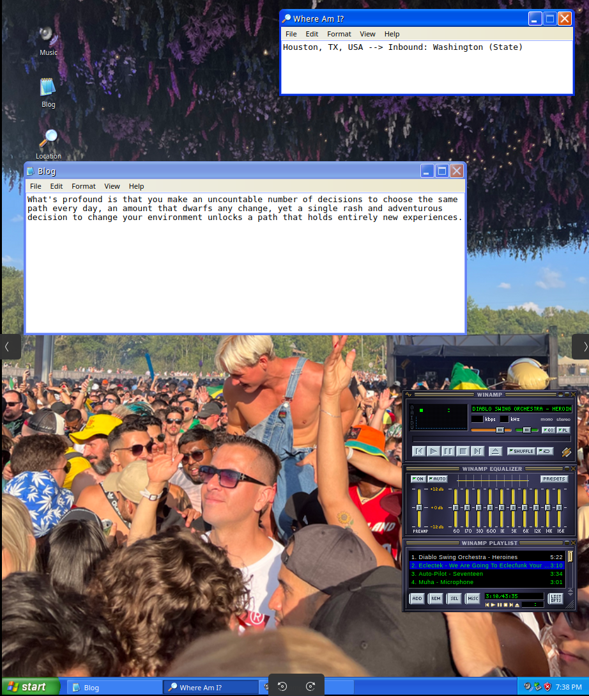

# retro - a node.js website for gunnar.ai

'retro' is a node.js website designed for Gunnar.ai. It is a dynamic and responsive web application that provides a platform for users to interact with the Gunnar.ai domain. The website is built using modern web technologies and offers a range of features to enhance user experience.

## Table of Contents

- [Installation](#installation)
- [Usage](#usage)
- [Features](#features)
- [Contributing](#contributing)
- [License](#license)
- [Authors](#authors)
- [Acknowledgments](#acknowledgments)
- [Contact](#contact)
- [Additional Sections](#additional-sections)

## Installation

Before you begin the installation process, make sure you have Node.js and npm installed on your machine.

1. Clone the repository:
git clone https://github.com/itsnotgunnar/retro.git
2. Navigate to the project directory:
cd retro/winXP
3. Install the required dependencies:
npm install
4. Start the server:
npm start
The application will start running on `http://localhost:3000`.

## Usage

Once the application is running, open your web browser and navigate to `http://localhost:3000`. You will be greeted with the homepage of the website.

- To interact with the website, you can:
  - Register a new account
  - Login with your existing account
  - Browse through the available features

## Features

- User Authentication: Register and login to access personalized features.
- Responsive Design: The website is fully responsive and works on all devices.
- Dynamic Content: Content is dynamically loaded based on user interactions.

## Contributing

We welcome contributions from the community. If you would like to contribute to the project, please follow these guidelines:

1. Fork the repository.
2. Create a new branch for your changes.
3. Make your changes and commit them to your branch.
4. Submit a pull request with your changes.

Please make sure to follow the coding conventions and standards used in the project.

## Authors

- Gunnar [itsnotgunnar](https://github.com/itsnotgunnar)

## Acknowledgments

We would like to thank the following individuals and organizations for their support and contributions to the project:

- [OpenAI](https://openai.com) for providing the language model used in this project.
- [Node.js](https://nodejs.org) for providing the runtime environment for the application.

## Contact

For any inquiries or support, please contact us at:

- Email: support@gunnar.ai
- Twitter: [@itsnotgunnar](https://twitter.com/itsnotgunnar)

## Additional Sections

### Troubleshooting

If you encounter any issues while installing or using the application, please check the [FAQs](FAQs.md) section or submit a bug report on the [GitHub repository](https://github.com/itsnotgunnar/retro/issues).

### FAQs

Please refer to the [FAQs](FAQs.md) document for answers to common questions.

### Roadmap

For information on upcoming features and improvements, please refer to the [Roadmap](ROADMAP.md) document.
